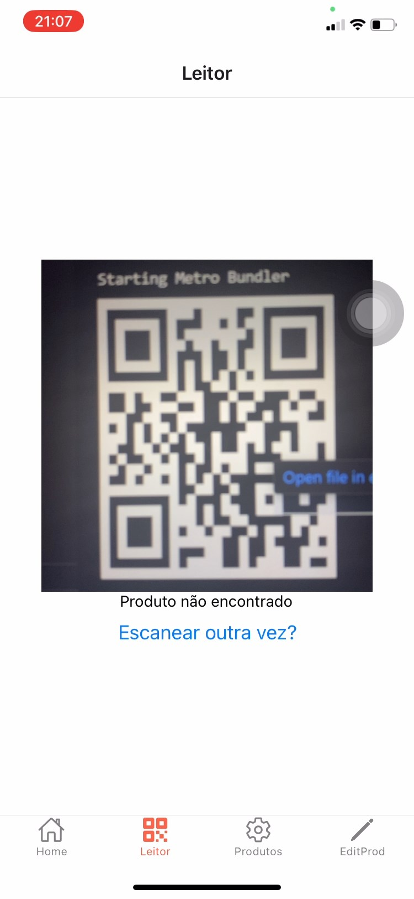

# Projeto QRcode

O projeto foi uma atividade acadêmica desenvolvida como parte do Curso de Técnico/a Especialista em Tecnologias e Programação de Sistemas de Informação, na UFCD de Desenvolvimento Mobile. O objetivo principal era aplicar os conceitos de desenvolvimento mobile utilizando React Native, JavaScript e Node.js. Especificamente, o projeto visava implementar a navegação entre telas, a integração com uma API para leitura de códigos QR e o uso do AsyncStorage para armazenamento local de dados.

## Descrição Geral do Projeto

### Base de Dados do Sistema

Os dados do sistema são armazenados localmente utilizando o AsyncStorage do React Native para persistência de dados.

## Objetivos do Projeto

Desenvolver um aplicativo móvel que permita gerenciar o estoque da empresa de forma eficiente, possibilitando a inserção, edição, exclusão e visualização de produtos, bem como a leitura rápida de códigos QR para identificação dos itens.

## Metodologia

O projeto foi desenvolvido seguindo uma metodologia ágil.

## Desenvolvimento

O aplicativo é desenvolvido utilizando o framework React Native para a criação das interfaces de usuário e a integração com a API para a leitura de códigos QR. O Node.js é utilizado para o desenvolvimento da API.

## Funcionalidades

Tela inicial: exibe as opções de navegação do aplicativo.
Tela de leitura de QR Code: permite a leitura rápida de códigos QR para identificação dos produtos.
Tela de exibição de produtos: apresenta uma lista dos produtos cadastrados, permitindo a visualização detalhada de cada item.
Tela de inserção, edição e exclusão de produtos: possibilita a manipulação dos dados dos produtos, incluindo nome, preço, quantidade e código QR.

## Resultado

## Tela Inicial

## Tela QR permissao

## Tela QR liberada

## Tela Inserir/Editar/Ecluir

## Tela Exibicao

## Tela Leitura

## Tela Excluir

## Conclusão

O desenvolvimento do aplicativo em React Native foi uma experiência enriquecedora, permitindo o aprimoramento das habilidades em desenvolvimento mobile e integração com APIs. 
